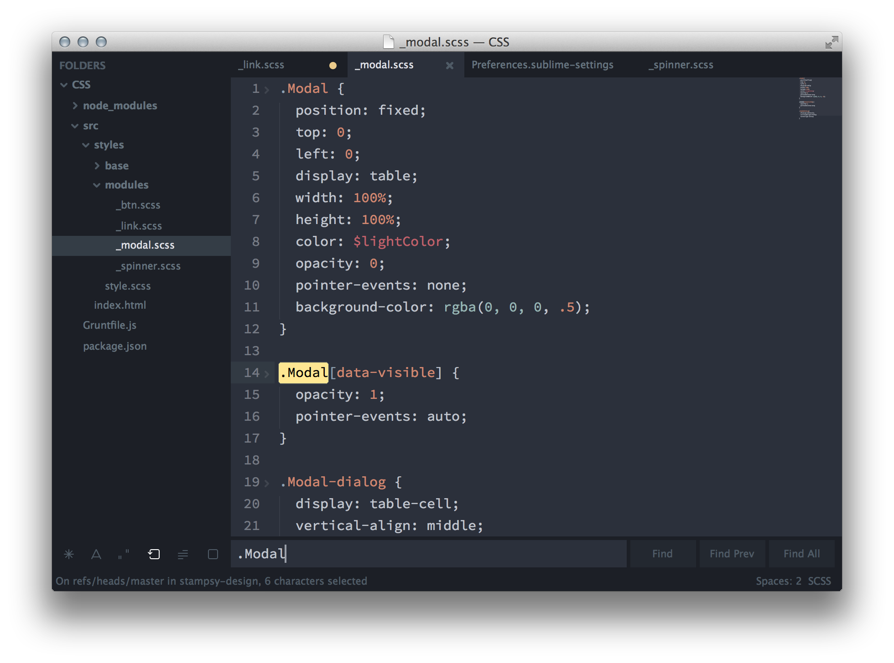

# Spacegray

Spacegray is all about hype and minimal.



## Install

### Via Package Control

Theme is listed as `Theme - Spacegray` in Will Bond's [Sublime Package Control](https://sublime.wbond.net).

### Manual

1. [Download the .zip](https://github.com/kkga/spacegray/archive/master.zip)
2. Unzip and rename the folder to `Theme - Spacegray`
3. Copy the folder into `Packages` directory, which you can find using the menu item `Preferences -> Browse Packages...` in Sublime Text

## Setup

Activate the UI theme and color scheme by modifying your user preferences file, which you can find using the menu item `Preferences -> Settings - User` in Sublime Text or by clicking `cmd + ,` on a Mac.

Spacegray works best and comes with [Base16 Ocean](http://chriskempson.github.io/base16/#ocean) color scheme by Chris Kempson.

### Example settings
```
{
  "theme": "Spacegray.sublime-theme",
  "color_scheme": "Packages/Theme - Spacegray/base16-ocean.dark.tmTheme"
}
```
