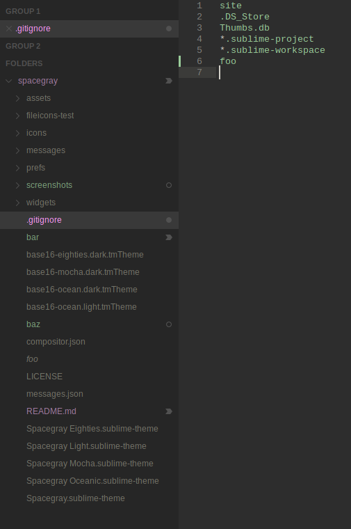

# Spacegray

A set of custom UI themes for Sublime Text. It's all about hype and minimal. Comes in different flavors with accompanying [Base16](https://github.com/chriskempson/base16) color schemes.

### Themes

#### Spacegray

Default flavor based on Base16 Ocean Dark color scheme.


#### Spacegray Light

Light variation based on Base16 Ocean Light color scheme.


#### Spacegray Eighties

A variation based on Base16 Eighties Dark color scheme.


*The font used in the screenshots is [__Source Code Pro__](https://github.com/adobe-fonts/source-code-pro).*

***

### How to Install

#### Via Package Control

The easiest way to install is using [Sublime Package Control](https://sublime.wbond.net), where Spacegray is listed as `Theme - Spacegray`.

1. Open Command Palette using menu item `Tools -> Command Palette...` (<kbd>⇧</kbd><kbd>⌘</kbd><kbd>P</kbd> on Mac)
2. Choose `Package Control: Install Package`
3. Find `Theme - Spacegray` and hit <kbd>Enter</kbd>

#### Manual

You can also install the theme manually:

1. [Download the .zip](https://github.com/kkga/spacegray/archive/master.zip)
2. Unzip and rename the folder to `Theme - Spacegray`
3. Copy the folder into `Packages` directory, which you can find using the menu item `Sublime Text -> Preferences -> Browse Packages...`

***

### How to Activate

To select a theme call _UI: Select Theme_ from Command Palette.

To select a color scheme call _UI: Select Color Scheme_ from Command Palette.

Alternatively ajdust _Preferences.sublime-settings_ by calling _Preferences: Settings_ from Command Palette to one of the following pairs.

#### Settings for Spacegray

```json
{
  "theme": "Spacegray.sublime-theme",
  "color_scheme": "Base16 Ocean Dark.sublime-color-scheme"
}
```

#### Settings for Spacegray Light

```json
{
  "theme": "Spacegray Light.sublime-theme",
  "color_scheme": "Base16 Ocean Light.sublime-color-scheme"
}
```

#### Settings for Spacegray Eighties

```json
{
  "theme": "Spacegray Eighties.sublime-theme",
  "color_scheme": "Base16 Eighties Dark.sublime-color-scheme"
}
```

#### Settings for Spacegray Oceanic

```json
{
  "theme": "Spacegray Oceanic.sublime-theme",
  "color_scheme": "Base16 Oceanic.sublime-color-scheme"
}
```

***

### Settings

#### Font Face

Global font face is set to `"system"`.

To customize font face,

1. select _UI: Customize Theme_
2. modify `"font_face"` variable

#### Font Size

Global font size is derived from _Preferences.sublime-settings > "font_size"_ by default.

To customize it, 

1. select _UI: Customize Theme_
2. modify `"font_size"` variable

#### Tabs size

Tabs height:

```json
  "spacegray_tabs_size": "small"
```
```json
  "spacegray_tabs_size": "normal"
```
```json
  "spacegray_tabs_size": "large"
```
```json
  "spacegray_tabs_size": "xlarge"
```

Tabs width:

```json
  "theme.spacegray.tabs.auto_width": true
```

#### Hide navigation icons in Sublime Text

```json
  "enable_tab_scrolling": false,
```

#### Sidebar tree rows height

```json
  "theme.spacegray.sidebar.row_height": "xsmall"
```
```json
  "theme.spacegray.sidebar.row_height": "small"
```
```json
  "theme.spacegray.sidebar.row_height": "normal"
```
```json
  "theme.spacegray.sidebar.row_height": "large"
```
```json
  "theme.spacegray.sidebar.row_height": "xlarge"
```

#### Enable sidebar file icons

```json
  "theme.spacegray.sidebar.show_icons": true,
```


#### Enable sidebar item label vcs coloring

```json
  "theme.spacegray.sidebar.vcs_color_labels": true,
```



To also color expanded folders:

```json
  "theme.spacegray.sidebar.vcs_color_expanded": true,
```

Originally implemented in [Toxin](https://github.com/p3lim/sublime-toxin) by [@p3lim](https://github.com/p3lim).

#### Disable Themed Title Bar in Sublime Text

Useful if you're using native OSX tabs since custom title bar breaks the native tabs.

```json
  "themed_title_bar": false,
```

***

### Thanks

The Spacegray Eighties variation is contributed by [Yoshua Wuyts](https://github.com/yoshuawuyts).
