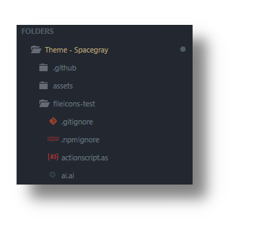

# Spacegray

A set of custom UI themes for Sublime Text. It's all about hype and minimal. Comes in different flavors with accompanying [Base16](https://github.com/chriskempson/base16) color schemes.

### Themes

#### Spacegray

Default flavor based on Base16 Ocean Dark color scheme.


#### Spacegray Light

Light variation based on Base16 Ocean Light color scheme.


#### Spacegray Eighties

A variation based on Base16 Eighties Dark color scheme.


#### Spacegray Mocha

A variation based on Base16 Mocha Dark color scheme.


#### Spacegray Oceanic

A variation based on Base16 Oceanic Dark color scheme.


*The font used in the screenshots is [__Cascadia Code__](https://github.com/microsoft/cascadia-code).*

***

## Installation

### Via Package Control

The easiest way to install is using [Sublime Package Control](https://sublime.wbond.net), where Spacegray is listed as `Theme - Spacegray`.

1. Open Command Palette using menu item _Tools > Command Palette..._ (<kbd>⇧</kbd><kbd>⌘</kbd><kbd>P</kbd> on Mac)
2. Choose _Package Control: Install Package_
3. Find `Theme - Spacegray` and hit <kbd>Enter</kbd>

### Manual

You can also install the theme manually:

1. [Download the .zip](https://github.com/kkga/spacegray/archive/master.zip)
2. Unzip and rename the folder to `Theme - Spacegray`
3. Copy the folder into `Packages` directory, which you can find using the menu item `Sublime Text -> Preferences -> Browse Packages...`

***

## Activate Theme

To select a theme call _UI: Select Theme_ from Command Palette.

To select a color scheme call _UI: Select Color Scheme_ from Command Palette.

Alternatively ajdust _Preferences.sublime-settings_ by calling _Preferences: Settings_ from Command Palette to one of the following pairs.

#### Settings for Spacegray

```json
{
  "theme": "Spacegray.sublime-theme",
  "color_scheme": "Base16 Ocean Dark.sublime-color-scheme"
}
```

#### Settings for Spacegray Light

```json
{
  "theme": "Spacegray Light.sublime-theme",
  "color_scheme": "Base16 Ocean Light.sublime-color-scheme"
}
```

#### Settings for Spacegray Eighties

```json
{
  "theme": "Spacegray Eighties.sublime-theme",
  "color_scheme": "Base16 Eighties Dark.sublime-color-scheme"
}
```

#### Settings for Spacegray Mocha

```json
{
  "theme": "Spacegray Mocha.sublime-theme",
  "color_scheme": "Base16 Mocha Dark.sublime-color-scheme"
}
```

#### Settings for Spacegray Oceanic

```json
{
  "theme": "Spacegray Oceanic.sublime-theme",
  "color_scheme": "Base16 Oceanic.sublime-color-scheme"
}
```

***

## Theme Customization

Themes are customized either by adjusting predefined settings 
or by modifying global theme variables or rules.

Open Command Palette and call one of:

1. _Preferences: Settings_
2. _UI: Customize Theme_

### Theme Variables

#### Font Face

Global font face is set to `"system"`.

To customize font face,

1. open Command Palette
2. call _UI: Customize Theme_
3. modify `"font_face"` variable

#### Font Size

Global font size is derived from _Preferences.sublime-settings > "font_size"_ by default.

To customize font size, 

1. open Command Palette
2. call _UI: Customize Theme_
3. modify `"font_size"` variable

### Global Theme Settings

To customize theme settings,

1. open Command Palette
2. call _Preferences: Settings_  

#### Themed Title Bar

Useful if you're using native OSX tabs since custom title bar breaks the native tabs.

```json
  "themed_title_bar": false,
```

#### Tabs Navigation Icons

```json
  "enable_tab_scrolling": false,
```

#### Tabs Close Buttons

Hide tab close buttons:

```json
  "show_tab_close_buttons": false,
```

Display tab close buttons on the left:

```json
  "show_tab_close_buttons_on_left": true,
```

### Spacegray Theme Settings

To customize theme settings,

1. open Command Palette
2. call _Preferences: Settings_  

#### Tabs Size

Tabs height:

```json
  "theme.spacegray.tabs.height": "small"
```

```json
  "theme.spacegray.tabs.height": "normal"
```

```json
  "theme.spacegray.tabs.height": "large"
```

```json
  "theme.spacegray.tabs.height": "xlarge"
```

Tabs width:

```json
  "theme.spacegray.tabs.auto_width": true
```

#### Sidebar Tree Row Height

```json
  "theme.spacegray.sidebar.row_height": "xsmall"
```
```json
  "theme.spacegray.sidebar.row_height": "small"
```
```json
  "theme.spacegray.sidebar.row_height": "normal"
```
```json
  "theme.spacegray.sidebar.row_height": "large"
```
```json
  "theme.spacegray.sidebar.row_height": "xlarge"
```

#### Sidebar File Icons

```json
  "theme.spacegray.sidebar.show_icons": true,
```



#### Sidebar Item Label VCS Coloring

```json
  "theme.spacegray.sidebar.vcs_color_labels": true,
```

To also color expanded folders:

```json
  "theme.spacegray.sidebar.vcs_color_expanded": true,
```

Originally implemented in [Toxin](https://github.com/p3lim/sublime-toxin) by [@p3lim](https://github.com/p3lim).

***

### Thanks

The Spacegray Eighties variation is contributed by [Yoshua Wuyts](https://github.com/yoshuawuyts).
